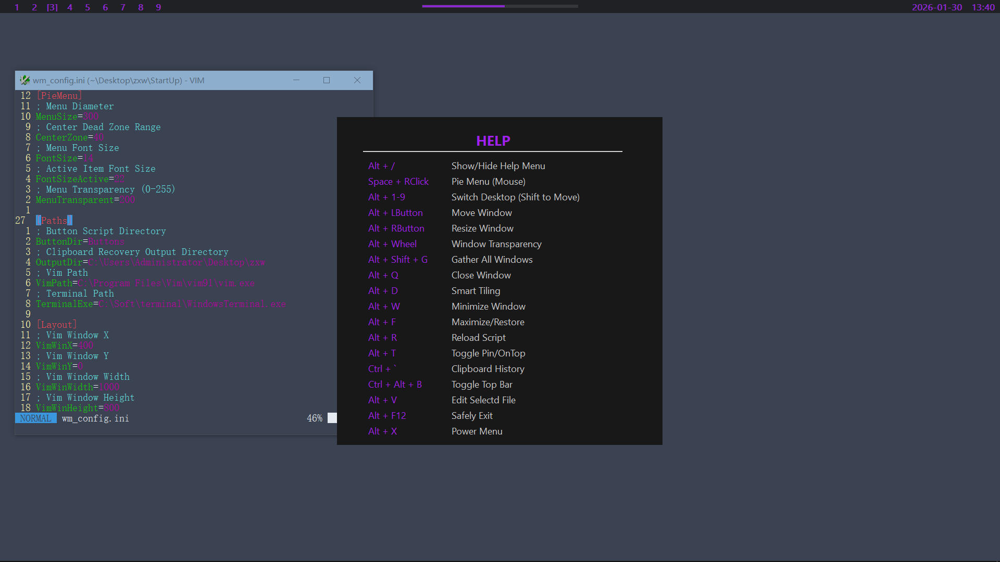
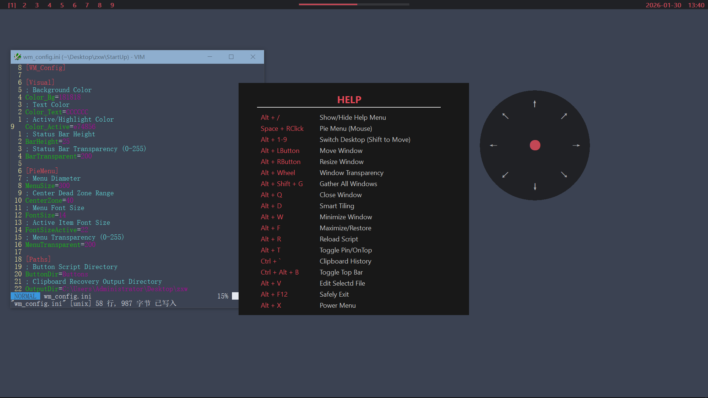

# AHK WM

---

This is a small personal project created to solve my own workflow needs.

At work, I often have to keep a large number of windows open at the same time.  
The computer is shared with other people, so installing or configuring complex tiling window managers is not an option.  
Because of that, I wrote this AutoHotkey script to manage windows in a lightweight and self-contained way.

If you have similar needs, I hope this script can be helpful to you as well.

---

## Features & Goals

The goal of this script is to provide basic window management and productivity features with as little external dependency as possible.

All you need to do is:

- install **AutoHotkey v2**
- disable Windows window animations
- run the script

The script currently includes:

- 9 virtual desktops  
- KDE-style window dragging  
- Window transparency control  
- A minimal status bar  
- Clipboard management  
- A customizable radial (pie) menu  

Everything is implemented in a single AHK script.

---

## Screenshots

---

## Installation

1. Install **AutoHotkey v2**
2. Download or clone this repository
3. Run the script by double-clicking it  

Alternatively, you can download and run the precompiled `.exe` file if you prefer.

---

This is a purely hobby project.  
Feedback, suggestions, and criticism are all welcome.
